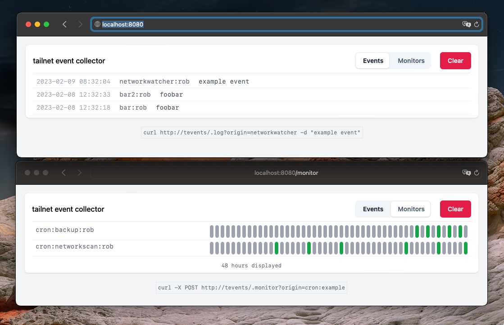

# tevents

tevents is a small tool to be deployed in your [tailnet](https://tailscale.com/kb/1136/tailnet/) to collect events/hooks from other services.
By using [tsnet](https://tailscale.com/blog/tsnet-virtual-private-services/), it can be deployed as a virtual private service. This allows to centrally collect
events in your network and display them on a web interface.



## Usage

All required resources are embedded in the executable.

```
git clone github.com/rverton/tevents
cd tevents && make
export TS_AUTHKEY=tskey-auth-xyu # can be retrieved via admin panel
go build -o tevents ./cmd/tevents
./tevents # all assets are embedded in this binary
```

## Events
An event holds the following fields:

```
origin: (unique) identifier of the sender
type: type of the event (event or monitor-event)
body: content
owner: tailnet owner who send the event
```

There are two different types of events:

- Log events are simple one-time HTTP requests to to notify of a specific event.
- Monitor events are events that are sent periodically and allow you to graph execution. This allows for example to watch cron jobs for execution.

## Submission

Events can be submitted via HTTP POST.

```
# example for log event
curl http://tevents/.log?origin=networkwatcher -d "new device found connected to network"

# example for monitoring a cron job executed every morning
0 1 * * * /usr/local/bin/backup.sh && curl -X POST http://tevents/.monitor?origin=cron:backup
```

## Development

All relevant tasks can be done via `make`:

```
make watch              # restart web server on code changes
make tailwind-watch     # watch tailwind css changes
make tailwind           # only build tailwind resources
make run                # run web server
make test               # run all tests
make                    # build executable with all assets embedded
```

### ToDo

- [ ] Add tests for event/monitor hook handler
- [ ] Make hour interval configurable
- [ ] Filter, search and pagination
- [ ] Allow to remove monitors (and all corresponding events)
- [x] Clear functionality
